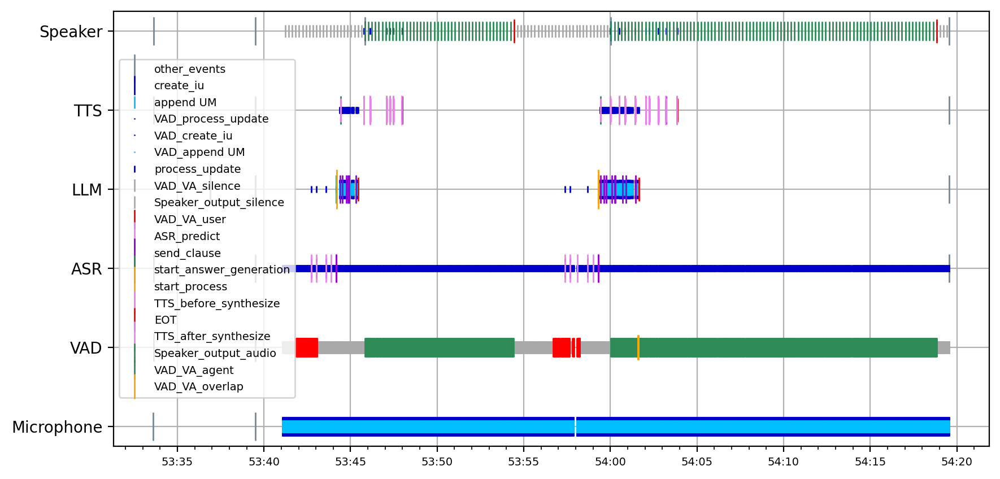

# Simple Retico Conversational Agent (part of Articulab's Son of Sara project)

This repository is a presentation of a simple conversational agent, build upon an incremental platform for dialogue system called [retico](https://github.com/retico-team/). The agent is built to have a oral conversation  with the user, following a pre-defined scenario. This agent was developped as part of Son-of-Sara project, by [Articulab](https://articulab.hcii.cs.cmu.edu/), a multi-disciplinary cognitive science team, member of the Almanach project team, of the French public research center [Inria Paris](https://www.inria.fr/en).

This agent is composed of multiple retico modules, each providing the system with a dialogue-related capacity (comprehension, answer generation, memory, etc). Some module use deep learning models to perform complex tasks.
The system contains the following new modules :

- VAD : calculates the voice activity of the user from the audio captured by the microphone.
- ASR : predicts the transcription of the user speech, alongside with a prediction of its beginning and end of turns (using VAD information).
- LLM : generates a textual answer to the user turn, and the dialogue history (previous turns of agent and user).
- DialogueHistory : keeps the previous turns of agent and user, calculates the largest possible history and formats the previous turns into a LLM prompt with the desired template.
- TTS : generates the voice of the agent corresponding to the textual answer from the LLM.
- Speaker : outputs the voice of the agent through computer's speakers, and send agent's voice activity information to VAD.

## Pre-requisties

- Cuda installation

## Installation

Clone the github repository

```bash
git clone https://github.com/articulab/simple-retico-agent.git
```

Install package

```bash
cd simple-retico-agent
pip install .
```

Install llama-cpp-python (on its own because of the special installation). The cuda wheel needs to match your cuda version (here cu124 is for cuda version 12.4)

```bash
pip install llama-cpp-python --extra-index-url https://abetlen.github.io/llama-cpp-python/whl/cu124
```

## Run the system

The package contains a main file, showing an example of how to initialize the network of modules and run the system.

### Presentation of the main file

In the `main_simple` function of this file are set some variable required by the modules :

```python
frame_length = 0.02
tts_frame_length = 0.2
rate = 16000
...
```

Logging and plotting is configured :

```python
terminal_logger, _ = retico_core.log_utils.configurate_logger(
    log_folder, filters=filters
)

# configure plot
configurate_plot(
    is_plot_live=plot_live,
    refreshing_time=1,
    plot_config_path=plot_config_path,
    module_order=module_order,
    window_duration=30,
)
...
```

Modules are initialized :

```python
mic = audio.MicrophoneModule()

vad = SimpleVADModule(
    input_framerate=rate,
    frame_length=frame_length,
)
...
```

Network is constructed :

```python
mic.subscribe(vad)
vad.subscribe(asr)
asr.subscribe(llm)
...
```

System is executed, until the `ENTER` key is pressed :

```python
network.run(mic)
print("Dialog system running until ENTER key is pressed")
input()
network.stop(mic)
```

### Run

To run the system, just call the main file :

```bash
python main.py
```

The system will them launch every module and start deploying the deep learning models on the GPU (or CPU if it is the option you chose).
The message `Dialog system running until ENTER key is pressed` will be printed in the terminal, to show you that the system is running.
If you speak to the system, after a short time, you should hear the system answering you.
If you want to quit, and close the system, press the `ENTER` key.

A log file will be created (in `src/simple_retico_agent/logs/run_0/log.log` if it wasn't modified), and will receive every log message of every module during the system's execution.

A plot of the system's execution will be created (in `src/simple_retico_agent/run_plots/run_0/plot_IU_exchange.png` if it wasn't modified), and will show information, in real time, about IUs exchanges between modules (create_iu, process_update, etc), dialogue events (user BOT, user EOT, etc), or internal events (start_generation, etc).



